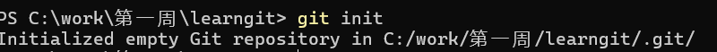

# 初始化

## Git

分布式版本管理系统，使用C++写的

## 配置

```bash
git config --global user.name "Lihong"
git config --global user.email "lihong.yang@coolkit.cn"

```

## 创建git仓库

将本地的文件夹变成git可以管理的仓库，执行`git init`



> 在本地会生成.git文件夹，用于追踪仓库。不能随意修改
