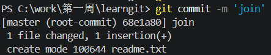

# 本地文件

## 添加文件到本地仓库

当**文本**文件改动后，git就能去追踪到这个文件的变动，但是，它不知道**二进制文件**的内容变动，比如图片、视频、音频、word等文件，只知道它们的文件大小发生了变化

### 创建一个readme.txt

```txt
我在酷宅工作
```

### 执行`git add`指令，将文件添加到暂存区

```bash
git add readme.txt
```

### 执行`git commit`指令，将文件提交到仓库

```bash
git commit -m 'join'
```



> -m '' 表示添加提交说明, 1 insertion(+) 表示插入一行内容。可以多次add后执行commit
