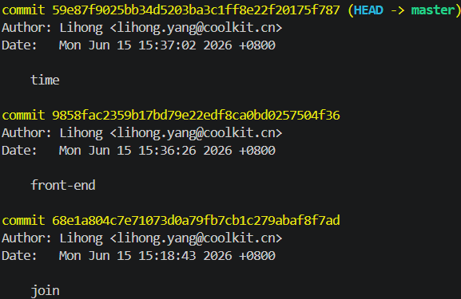
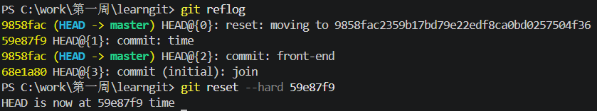

# 版本管理

## 版本回退

当有了多个提交记录，想回退到某一次提交


### 查看commit id

```bash
git log
```



找到需要回退版本的commit id，即：9858f...

### 执行回退命令

```bash
1.回撤上一个版本 HEAD^ 表示上一个版本；HEAD^^ 表示上上一个版本 以此类推
git reset --hard HEAD^

2.如果回撤第10个 可简写 HEAD~10
git reset --hard HEAD~10

3.精确回撤
git reset --hard <commit id>
```

参数意义：
**--hard**：工作区、暂存区、commit都撤回
**--soft**：commit撤回，变动保留到暂存区
**--mixed**：默认参数，commit和暂存区撤回，变动保留到工作区

执行`git reset --hard 9858...`就实现了


> 如果这次回退不想要了，想要的是刚刚没有回退前的版本，使用 git reflog 查找到 commit id 重新 reset
> 

## 撤销修改

1. 当修改了工作区的文件，想直接丢弃，使用`git checkout -- <file>`
2. 当修改了工作区的文件后，并且添加到了暂存区，想丢弃，先执行`git reset HEAD <file>`，从暂存区 -> 工作区（变为第一种情况）
3. commit后，但是没有push到远程仓库，直接执行版本回退
