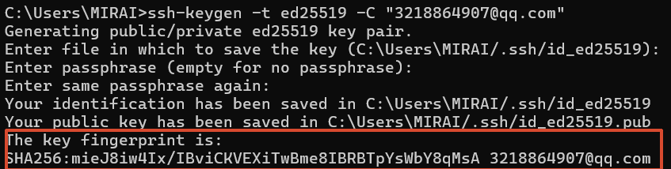

# 远程仓库

关联远程仓库（由于https不太稳定，所以采用ssh）

```bash
git remote add origin git@github.com:MIRAI-Lihong/learngit.git
```

> origin 为远程仓库的别名

查看远程仓库

```bash
git remote -v
```

生成ssh密钥

```bash
ssh-keygen -t ed25519 -C "GitHub邮箱"
```



添加ssh密钥
**GitHub Settings > SSH and GPG keys > New SSH Key**

将本地仓库发送到远程仓库

```bash
git push -u origin master
```

> -u 将本地仓库的 master 和远程仓库的 master 分支建立关联，之后 push 代码不需要添加 -u
