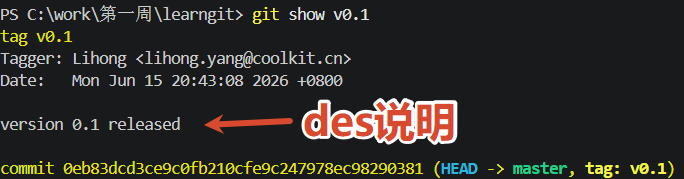

# 标签管理

> tag是和commit一起的，不同分支的同一commit，在这些分支上都可以看到tag

**添加标签**：

- **HEAD**：`git tag <name>`
- **指定commit id**：`git tag <name> <commit id>`
- **带说明**：`git tag -a <name> -m "<des>" <commit id>`

**查看标签**：`git tag`
**查看详情**：`git show <name>`

**删除标签**：

- **本地**： `git tag -d <name>`
- **远程**：`git push origin :refs/tags/<name>`

**推送标签**：

- **单个推送**`git push origin <name>`
- **批量推送**：`git push origin --tags`
